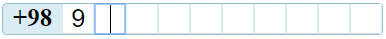
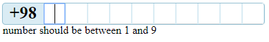

# mobileMask

Mobile mask directive for angularjs

## Requirements

- AngularJS

## Usage

### NPM

```sh
npm i mobilemask
```

Load the script files in your application:

```html
<script
  type="text/javascript"
  src="node_modules/mobilemask/dist/mobileMask.js"
></script>
```

```javascript
angular.module('myApp', ['ngMobileMask', ...]);
```

## Example

## html

```html
<mobile-mask
  mask-id="'mobile'"
  country-code="98"
  number-count="10"
  ng-model="mobile"
  valid-numbers-for-first-number="'1-9'"
  errors="errors"
  is-valid="isValid"
></mobile-mask>
```

## Image 1



## Image 2

if first number less or bigger than valid numbers



- `mask-id` : For focus when use multiple directive ,
- `country-code` : For set country code ,
- `number-count` : Numbers count after area code ,
- `valid-numbers-for-first-number` : for valid numbers for first number after area code
- `errors` : Return errors occur in directive ,
- `is-valid` : If number is valid return true else return false ,

## for use css

```html
<link
  href="dist/css/myStyles.css"
  rel="node_modules/mobilemask/dist/mobileMask.css"
/>
```

<a href="http://mm.hadijahangiri.ir/" target="_blank">Demo</a>
